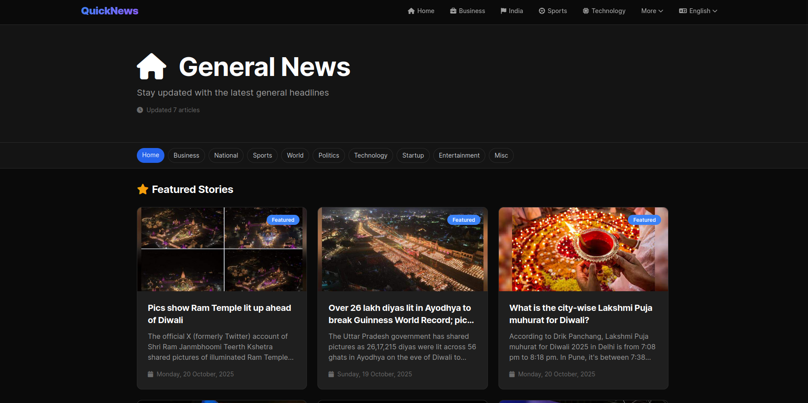
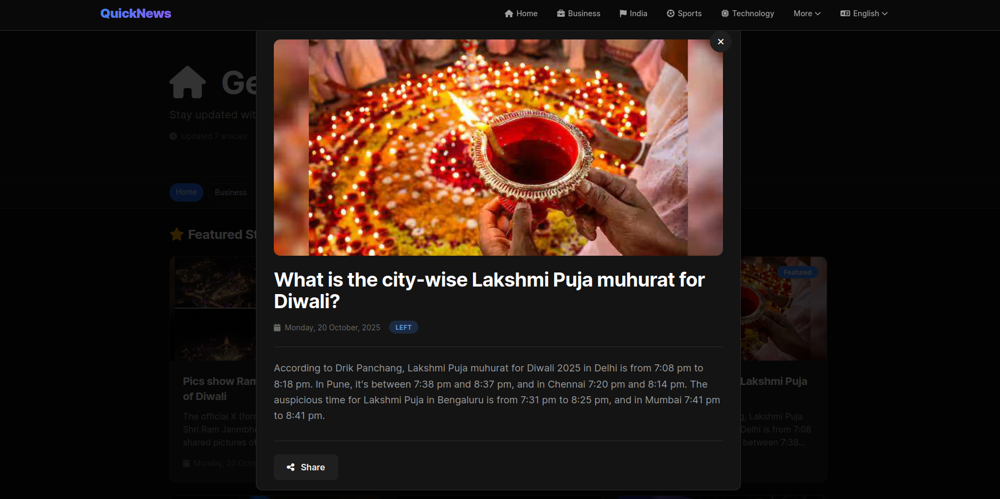
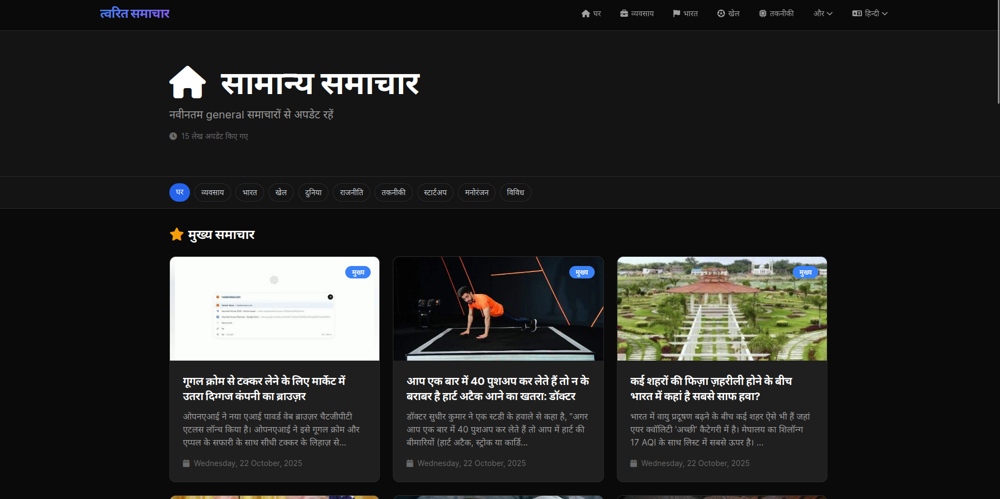
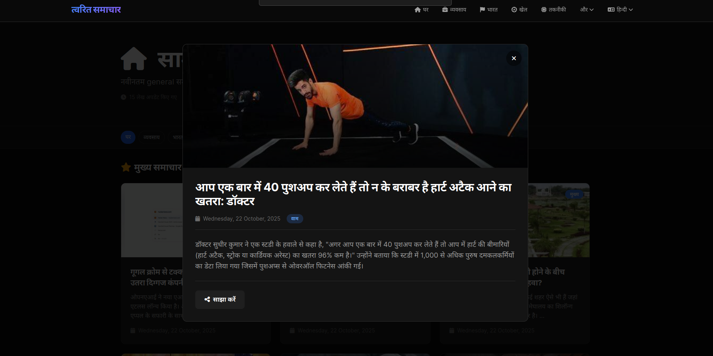

# QuickNews - Modern News Aggregation App

A modernized Django-based news aggregation application that scrapes and displays news from Inshorts.com in both English and Hindi, featuring a sleek dark theme and professional UI/UX.

## 🚀 Live Demo

**Visit the live application**: [https://quicknews.karanjot.co.in](https://quicknews.karanjot.co.in)

Deployed using Docker containers and hosted on Cloudflare for optimal performance and reliability.

## About This Project

This project started as my **first Django project** during college in **2021** and has been completely revamped with modern web development practices. It showcases the evolution from a learning project to a production-ready application with professional-grade features.

### 📜 Project History

**Original Project (2021)**: The original Django News application can be found at:
- 🔗 **Old Repository**: [https://github.com/Karanjot786/Django-News](https://github.com/Karanjot786/Django-News)
- This repository contains the legacy codebase from my college days

**Current Version (2025)**: This repository represents a complete modernization with:
- Complete UI/UX redesign with professional dark theme
- Refactored codebase using modern Django practices
- Enhanced features and performance optimizations
- Production-ready code with comprehensive error handling

> **Note**: Compare the old and new versions to see the evolution in code quality, design patterns, and feature implementation!

### What's New in 2025
- ✅ **Modern Dark Theme UI** - Professional dark interface with smooth transitions
- ✅ **Interactive Modal Dialogs** - Click any article to read full content in a beautiful modal
- ✅ **Optimized Scraping** - Enhanced error handling and duplicate prevention
- ✅ **Smart Sorting** - Articles sorted by publication date (newest first)
- ✅ **Infinite Scroll** - Seamless content loading as you scroll
- ✅ **Category Filtering** - Filter news by political leaning (left/center/right)
- ✅ **View Modes** - Toggle between grid and list layouts
- ✅ **Share Functionality** - Easy article sharing with native browser API
- ✅ **Responsive Design** - Fully optimized for mobile, tablet, and desktop
- ✅ **Performance Optimized** - Lazy loading, efficient database queries, and caching
- ✅ **Docker Deployment** - Containerized for easy deployment and scaling
- ✅ **Production Ready** - Live at [quicknews.karanjot.co.in](https://quicknews.karanjot.co.in) hosted on Cloudflare

## Features

### Core Functionality
- 📰 **Real-time News Scraping** - Fetches latest articles from Inshorts.com
- 🌐 **Bilingual Support** - Full support for English and Hindi content
- 🔄 **Auto-refresh** - Smart caching with automatic updates
- 🎯 **10 News Categories**:
  - General News
  - Business
  - National (India)
  - Sports
  - World News
  - Politics
  - Technology
  - Startup
  - Entertainment
  - Miscellaneous

### User Interface
- 🎨 **Professional Dark Theme** - Eye-friendly dark mode with CSS custom properties
- 📱 **Fully Responsive** - Seamless experience across all devices
- 🖼️ **Article Modals** - Click any article to view in an elegant dialog
- 🔍 **Quick Categories** - Sticky navigation for fast category switching
- 📊 **Dual View Modes** - Switch between grid and list layouts
- 🏷️ **Political Leaning Filter** - Filter by left, center, or right leaning sources
- ♾️ **Infinite Scroll** - Load more articles automatically as you scroll
- ⚡ **Smooth Animations** - Professional transitions and hover effects

### Technical Features
- 🛡️ **Duplicate Prevention** - Intelligent article deduplication
- 📅 **Date-based Sorting** - Articles sorted by publication date
- 💾 **Smart Caching** - Efficient data storage and retrieval
- 🚫 **Error Resilience** - Comprehensive error handling for scraping
- 🔗 **SEO Optimized** - Proper meta tags and semantic HTML

## Technology Stack

### Backend
- **Django 5.2.7** - Modern Python web framework
- **Python 3.8+** - Core programming language
- **SQLite** - Database for article storage
- **Class-based Views** - Modern Django ListView implementation

### Web Scraping
- **BeautifulSoup4 4.14.2** - HTML parsing
- **Requests 2.32.5** - HTTP library
- **lxml 6.0.2** - Fast XML/HTML parser

### Frontend
- **Tailwind CSS (CDN)** - Utility-first CSS framework
- **Vanilla JavaScript** - Interactive features and modal dialogs
- **Font Awesome** - Icon library
- **CSS Custom Properties** - Dynamic theming system
- **Intersection Observer API** - Infinite scroll implementation

### Deployment & Infrastructure
- **Docker** - Containerization for consistent deployments
- **Cloudflare** - Hosting and CDN for optimal performance
- **Gunicorn** - Production WSGI server
- **WhiteNoise** - Static file serving

## Required Python Packages

```
Django==5.2.7
beautifulsoup4==4.14.2
bs4==0.0.2
requests==2.32.5
lxml==6.0.2
```

## Project Structure

```
QuickNews/
├── DjangoNews/              # Main Django project configuration
│   ├── settings.py          # Development settings
│   ├── settings_production.py  # Production settings
│   ├── urls.py              # Root URL routing
│   └── wsgi.py              # WSGI configuration
├── news/                    # Core news application
│   ├── models.py            # Headline database model
│   ├── views_new.py         # Modern class-based views
│   ├── urls_new.py          # URL patterns for new views
│   ├── scraper.py           # Unified scraping logic
│   └── getnews/             # Legacy scraping modules
│       ├── getnews.py       # Category orchestration
│       └── news_sites/      # Site-specific scrapers
│           ├── getcbs.py    # English news scraper
│           └── gethindi.py  # Hindi news scraper
├── templates/               # Django templates
│   ├── base.html            # Base template with navigation
│   ├── news/                # English templates
│   │   └── news.html        # Main English news page
│   └── hindinews/           # Hindi templates
│       └── news.html        # Main Hindi news page
├── static/                  # Static assets
│   └── images/              # Screenshot assets
│       ├── new/             # Current version screenshots
│       │   ├── en/          # English screenshots
│       │   └── hi/          # Hindi screenshots
│       └── old/             # Legacy screenshots
├── Dockerfile               # Docker configuration
├── .dockerignore            # Docker ignore patterns
├── requirements.txt         # Python dependencies
├── DEPLOYMENT.md            # Deployment guide
├── QUICKSTART_DEPLOYMENT.md # Quick deployment instructions
└── manage.py                # Django CLI tool
```

## Installation and Setup

### Prerequisites
- Python 3.8 or higher
- pip (Python package installer)

### Installation Steps

1. **Clone the repository**
```bash
git clone https://github.com/Karanjot786/Django-News.git
cd new_Django_News
```

2. **Create and activate virtual environment** (recommended)
```bash
python3 -m venv env
source env/bin/activate  # On Windows: env\Scripts\activate
```

3. **Install dependencies**
```bash
pip install Django==5.2.7 beautifulsoup4==4.14.2 bs4==0.0.2 requests==2.32.5 lxml==6.0.2
# Or use: pip install -r requirements.txt
```

4. **Run database migrations**
```bash
python3 manage.py makemigrations
python3 manage.py migrate
```

5. **Create a superuser (optional - for admin access)**
```bash
python3 manage.py createsuperuser
```

6. **Start the development server**
```bash
python3 manage.py runserver
```

7. **Access the application**
   - **English News**: `http://127.0.0.1:8000/`
   - **Hindi News**: `http://127.0.0.1:8000/hindi/`
   - **Admin Panel**: `http://127.0.0.1:8000/admin/` (if superuser created)
   - **Specific Category**: `http://127.0.0.1:8000/technology/` or `http://127.0.0.1:8000/hindi/sports/`

## Deployment with Docker

The application is containerized using Docker for easy deployment and scalability.

### Docker Setup

1. **Build the Docker image**
```bash
docker build -t quicknews .
```

2. **Run the container**
```bash
docker run -p 8000:8000 quicknews
```

3. **Using Docker Compose** (recommended)
```bash
docker-compose up -d
```

### Production Deployment

The live application at [https://quicknews.karanjot.co.in](https://quicknews.karanjot.co.in) is deployed using:

- **Docker Containers**: Ensures consistent environment across development and production
- **Cloudflare Hosting**: Provides:
  - Global CDN for fast content delivery
  - DDoS protection and security
  - SSL/TLS encryption
  - DNS management
  - Performance optimization

For detailed deployment instructions, see [DEPLOYMENT.md](DEPLOYMENT.md) and [QUICKSTART_DEPLOYMENT.md](QUICKSTART_DEPLOYMENT.md).

## Screenshots

### Current Version (2025) - QuickNews

#### English Version

*Modern dark theme homepage with grid layout and featured articles*


*Interactive modal dialog showing full article content*

#### Hindi Version

*Hindi news homepage with professional dark theme*


*Hindi article modal with full content and sharing options*

### Legacy Version (2021) - Django News

Want to see how far we've come? Check out the original version:
- 📂 Screenshots available in `static/images/old/`
- 🔗 Original repository: [Django-News (2021)](https://github.com/Karanjot786/Django-News)

**Key Differences:**
| Feature | Old Version (2021) | New Version (2025) |
|---------|-------------------|-------------------|
| UI Theme | Light theme, basic styling | Professional dark theme |
| Layout | Simple list view | Grid/List toggle, featured articles |
| Article View | Opens in new tab | Interactive modal dialog |
| Navigation | Basic navbar | Sticky categories, quick filters |
| Mobile Support | Limited responsive | Fully responsive with touch support |
| Performance | Direct scraping on load | Smart caching, infinite scroll |
| Code Structure | Function-based views | Class-based views, modular design |
| Deployment | Basic server setup | Docker containers on Cloudflare |
| Production | Not deployed | Live at quicknews.karanjot.co.in |

## Migrating from Old Version

If you're coming from the [old Django-News repository](https://github.com/Karanjot786/Django-News), here's what you need to know:

### Database Migration
The database schema is compatible, but you'll need to:
1. Export your existing data (if any) using Django's `dumpdata` command
2. Set up the new repository following installation steps above
3. Import data using Django's `loaddata` command

### Key Code Changes
- **Views**: Migrated from function-based (`views.py`) to class-based (`views_new.py`)
- **Scraping**: Consolidated scraping logic in new `scraper.py`
- **Templates**: Completely redesigned with dark theme in `templates/news/news.html` and `templates/hindinews/news.html`
- **URLs**: New routing in `urls_new.py` alongside legacy `urls.py`

### Feature Parity
All features from the old version are available, plus:
- ✨ Modal dialogs for article reading
- ✨ Infinite scroll pagination
- ✨ Political leaning filters
- ✨ Grid/List view toggle
- ✨ Smart caching and duplicate prevention
- ✨ Date-based sorting

## Usage

### Basic Navigation
1. **Homepage**: Visit the root URL to see general English news
2. **Category Selection**: Click on any category in the navigation bar
3. **Language Toggle**: Use the language switcher to toggle between English and Hindi
4. **Article Reading**: Click on any article card to open it in a modal dialog
5. **Infinite Scroll**: Scroll down to automatically load more articles
6. **Filter News**: Use the leaning filter buttons to filter by political perspective
7. **View Modes**: Toggle between grid and list view using the view buttons
8. **Share Articles**: Click the share button to share articles via browser's native share API

### Data Management
- **Smart Caching**: Articles are cached in the database to reduce scraping
- **Auto-refresh**: New articles are fetched when visiting a category
- **Duplicate Prevention**: System automatically prevents duplicate articles from being stored
- **Date Sorting**: Articles are displayed with newest first

### Admin Features
Access the admin panel at `/admin/` to:
- View all stored headlines
- Manually add/edit/delete articles
- Monitor database contents
- Manage categories

## Recent Updates (2025)

### Major Revamp
- ✅ **Complete UI Overhaul**: Migrated from old design to modern dark theme
- ✅ **Class-based Views**: Refactored from function-based to modern ListView
- ✅ **Unified Scraper**: Created new `scraper.py` with consolidated logic
- ✅ **Modal Dialogs**: Added interactive article reading experience
- ✅ **Performance**: Implemented pagination, lazy loading, and efficient queries
- ✅ **Duplicate Prevention**: Smart duplicate detection by title
- ✅ **Date Sorting**: Articles now sorted by publication date
- ✅ **Error Handling**: Comprehensive error handling throughout scraping pipeline
- ✅ **Responsive Design**: Full mobile, tablet, and desktop optimization
- ✅ **SEO**: Added proper meta tags and semantic HTML
- ✅ **Docker Deployment**: Containerized application for consistent deployments
- ✅ **Production Launch**: Deployed live at [quicknews.karanjot.co.in](https://quicknews.karanjot.co.in) on Cloudflare

### Bug Fixes
- Fixed AttributeError issues in web scraping functions
- Resolved pagination duplicates
- Fixed favicon.ico routing issue
- Prevented article deletion on refresh
- Enhanced error resilience for missing HTML elements

## Architecture

### Database Model
```python
class Headline(models.Model):
    leaning = models.TextField()  # 'left', 'center', or 'right'
    title = models.TextField()
    img = models.URLField(max_length=1000, null=True, blank=True)
    content = models.TextField()
    date = models.TextField(null=True)
    url = models.URLField(max_length=1000)
    language = models.CharField(max_length=2)  # 'en' or 'hi'
    category = models.CharField(max_length=50)
    created_at = models.DateTimeField(auto_now_add=True)
```

### API Endpoints
- `GET /` - English general news
- `GET /<category>/` - English category news (business, sports, etc.)
- `GET /hindi/` - Hindi general news
- `GET /hindi/<category>/` - Hindi category news
- `GET /api/load-more/` - AJAX endpoint for pagination
- `GET /admin/` - Django admin panel

### Scraping Flow
1. User visits a category page
2. View checks database for recent articles (within cache time)
3. If needed, scraper fetches latest articles from Inshorts.com
4. Articles are parsed, deduplicated, and saved to database
5. View retrieves articles, sorts by date, and renders template
6. Frontend displays articles with infinite scroll

## Contributing

We welcome contributions! Here's how you can help:

1. **Fork the repository**
2. **Create a feature branch**
   ```bash
   git checkout -b feature/amazing-feature
   ```
3. **Make your changes**
   - Follow PEP 8 style guide for Python code
   - Add comments for complex logic
   - Test your changes thoroughly
4. **Commit your changes**
   ```bash
   git commit -m 'Add amazing feature'
   ```
5. **Push to your branch**
   ```bash
   git push origin feature/amazing-feature
   ```
6. **Open a Pull Request**

### Areas for Contribution
- 🐛 Bug fixes
- ✨ New features (e.g., user authentication, bookmarks)
- 📝 Documentation improvements
- 🎨 UI/UX enhancements
- 🌐 Additional language support
- 🧪 Testing improvements

## License

This project is open source and available under the [MIT License](LICENSE).

## Disclaimer

⚠️ **Important**: This application is for **educational purposes only**.

- Always respect the website's `robots.txt` and terms of service
- Implement rate limiting to avoid overloading the source website
- Do not use scraped content for commercial purposes without permission
- Be mindful of copyright and intellectual property rights

## Acknowledgments

- **Inshorts** - For providing concise news content
- **Django Community** - For the amazing web framework
- **BeautifulSoup** - For making web scraping accessible
- **Tailwind CSS** - For the utility-first CSS framework

## Contact & Support

- **Developer**: Karanjot Singh
- **GitHub**: [@Karanjot786](https://github.com/Karanjot786)
- **Current Project**: QuickNews (2025 Modernized Version)
- **Legacy Project**: [Django-News (2021)](https://github.com/Karanjot786/Django-News) - Original college project

### Project Repositories

| Version | Repository | Description |
|---------|-----------|-------------|
| 🆕 **New (2025)** | This repository | Modern QuickNews with dark theme, modals, and optimizations |
| 📜 **Old (2021)** | [Django-News](https://github.com/Karanjot786/Django-News) | Original college project showcasing learning journey |

---

⭐ If you found this project helpful, please consider giving it a star on both repositories to see the evolution!

### Show Your Support

- ⭐ **Star this repository** if you like the modernized version
- 🔄 **Check the old repository** to see how far the project has evolved
- 🐛 **Report issues** if you find any bugs
- 💡 **Suggest features** for future improvements
- 🤝 **Contribute** by submitting pull requests
